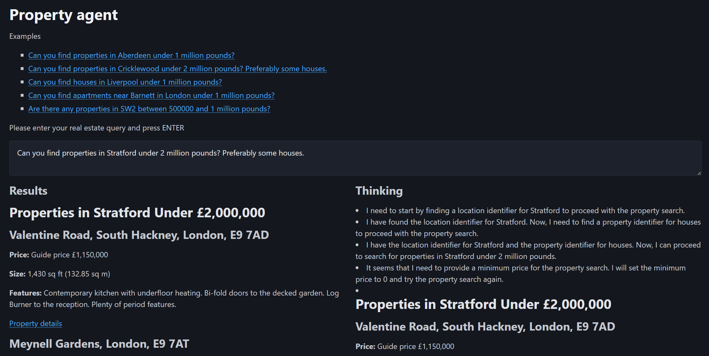

# DSPY Agents

Example project with DSPY Agents.

## Setup

We suggest to use [Conda](https://docs.conda.io/en/latest/) to manage the virtual environment and then install poetry.

```bash
conda deactivate
conda remove -n dspy_agents --all
conda create -n dspy_agents python=3.12
conda activate dspy_agents
pip install poetry
poetry install
```

## Configuration


## Run examples

Change directory to the root folder and then execute this command.

```bash
python ./dspy_agents/real_estate/test/test_simple_agent.py
```

## Running the UI

Change directory to the root folder and then execute this command.

```bash
python ./dspy_agents/real_estate/webapp.py
```

The server will start on http://localhost:5001

## Screenshots

This is how the application looks like:

